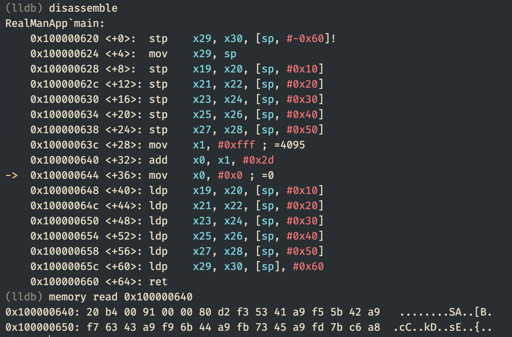

# 1부 — 맨몸으로 시작하기 (3시간)
### "상남자 코스"로 끝내는 ARM64 AArch64 어셈블리 — Apple Silicon Mac 기준

---

## 전체 흐름 (타임라인)

| 시간 | 세션 | 핵심 목표 |
|---|---|---|
| 0:00–0:15 | 오프닝 | 왜 어셈블리를 배우는가, 이 강좌의 태도 |
| 0:15–0:50 | 세션 1 | 레지스터와 CPU 모델의 그림 |
| 0:50–1:30 | 세션 2 | 명령어 형식 — mov/add/sub 실습 |
| 1:30–1:40 | 휴식 | — |
| 1:40–2:20 | 세션 3 | Apple Silicon ARM64 ABI — 함수 호출 규약 |
| 2:20–2:55 | 세션 4 | varargs의 함정 — scanf/printf 스택 강제 슬롯 |
| 2:55–3:00 | 클로징 | 요약 + 2부 예고 |

---

## 오프닝 (15분)

**전달할 톤**: 딱딱한 개념을 부드럽게. "어셈블리는 어렵다"가 아니라 "어셈블리는 정직하다"는 프레이밍.

대사 예시:
> "여러분, 고급 언어는 여러분에게 친절합니다. 근데 그 친절함 뒤에서 무슨 일이 일어나는지는 숨기죠. 어셈블리는 반대예요. 불친절한 대신, 아무것도 숨기지 않습니다. 오늘 우리는 그 정직함과 친해지는 시간을 가질 겁니다."

- 이 강좌가 다루는 범위: Apple Silicon (M-시리즈) 네이티브 AArch64
- Xcode 없이 터미널 + clang/as로 직접 어셈블/링크
- "12시간 뒤엔 여러분 손으로 QEMU에서 커널을 부팅시킵니다" — 4부 예고로 동기부여

---

## 세션 1 — 레지스터와 CPU 모델 (35분)

### 핵심 그림: CPU는 서랍장이다

- 범용 레지스터 `x0`–`x30` (64비트), 각각의 32비트 뷰는 `w0`–`w30`
- `sp` (스택 포인터), `pc` (프로그램 카운터, 직접 건드릴 수 없음)
- `xzr`/`wzr` — 항상 0인 레지스터 (하드웨어 트릭)

### 실습 1: 레지스터 들여다보기

```asm
// regs.S
.global _main
.align 2

_main:
    mov x0, #10 
    mov x1, #20
    add x2, x0, x1      // x2 = 30
    mov x0, #0
    ret
```

빌드 & 실행 + **lldb로 바로 레지스터 확인**:

```bash
as -g -o regs.o regs.s
ld -o regs regs.o -lSystem -syslibroot $(xcrun -sdk macosx --show-sdk-path) -e _main -arch arm64
lldb ./regs
(lldb) b regs.s:10
(lldb) run
(lldb) register read x0 x1 x2
```

> **강조 포인트**: 여기서 lldb를 처음부터 붙이는 이유 — "눈으로 보이지 않으면 안 믿는다"는 상남자 코스의 원칙. 3부에서 본격적으로 다룰 lldb를 여기서 맛보기로 심어둠.

### 32비트 vs 64비트 뷰 함정

```asm
mov x0, #-1        // x0 = 0xFFFFFFFFFFFFFFFF
mov w0, #-1        // w0 = 0xFFFFFFFF, 상위 32비트는 자동으로 0으로 클리어됨!
```

이 "w 레지스터에 쓰면 상위 32비트가 날아간다"는 규칙 — 나중에 준님이 Tower of Hanoi 디버깅에서 겪으신 **레지스터 폭 불일치 버그**의 근원이므로 여기서 확실히 짚고 넘어가기.

---

## 세션 2 — 명령어 형식과 mov/add/sub (40분)

### AArch64 명령어의 기본 문법

```
연산 목적지, 소스1, 소스2(옵션)
```

x86와 달리 **읽는 방향이 왼쪽에서 오른쪽** (destination이 먼저) — Intel 문법 헷갈리는 분들 위해 이 비교 한 번 짚어주기.

### mov 계열

```asm
mov x0, #42                 // 즉시값
mov x0, x1                  // 레지스터 간 복사
movz x0, #0x1234, lsl #16   // 큰 상수 조립 1단계
movk x0, #0x5678            // movk로 하위 비트 덮어쓰기 (movz/movk 조합)
```

> **실전 팁**: 16비트보다 큰 상수는 `mov` 한 줄로 안 들어갑니다. 어셈블러가 알아서 movz+movk로 풀어주긴 하지만, 원리를 알아야 나중에 최적화나 디버깅 시 당황하지 않습니다.

### add/sub — 즉시값과 shift

```asm
add x0, x1, x2                   // x0 = x1 + x2
add x0, x1, #100                 // 즉시값은 12비트까지 4096
add x0, x1, x2, lsl #2           // x0 = x1 + (x2 << 2) — 배열 인덱싱에 필수!
sub x0, x0, #1
```

## 명령어 구조 



### 맥에서 엔디안(Endianness) 을 확인하는 명령어 2가지

```bash

sysctl hw.byteorder
# 출력 결과 
hw.byteorder: 1234 # --> Little-Endian
hw.byteorder: 4321 # --> Big-Endian


python3 -c "import sys; print(sys.byteorder)"
# 출력 결과: little

```

### 엔디안 비하인드, 걸리버 여행기에서 진짜 나온 유래! 🥚

1981년 컴퓨터 과학자 대니 코헨(Danny Cohen)이 컴퓨터 아키텍처에서 "바이트를 어느 쪽부터 배치할 것인가"를 두고 논쟁이 벌어지자, 조나단 스위프트의 소설 《걸리버 여행기》를 인용해 논문을 쓰면서 공식 용어로 정착.

* **Big-Endian (빅 엔디안)**: 달걀을 깔 때 큰 쪽(Big End)부터 깨서 먹는 파!
* **Little-Endian (리틀 엔디안)**: 달걀을 깔 때 뾰족하고 작은 쪽(Little End)부터 깨서 먹는 파!

소설 속 '릴리퍼트(소인국)' 국가에서는 달걀을 어느 쪽으로 깨먹어야 하는지를 두고 무려 **6번의 전쟁**이 일어나고 11,000명이나 죽었다네. 코헨 박사는 **"달걀을 어디로 깨든 배로 들어가면 똑같듯, 메모리 바이트를 어디서부터 쓰든 연산만 제대로 되면 그만인데 왜 개발자들이 이 일로 싸우고 있냐!"** 라며 유쾌하게 꼬집었던 것이라네!

---

### 강의할 때 이렇게 입털면(?) 무조건 대성공이라네!

> **"여러분, M1/M2/M3/M4 맥이 왜 '리틀 엔디안'인지 아십니까? 애플이 뾰족한 쪽으로 달걀을 깨 먹는 '리틀 엔디안 파' 출신이라서 그렇습니다! 걸리버 여행기에서 달걀 깨는 방향 때문에 전쟁 난 것처럼, 컴퓨팅 세계에서도 메모리에 숫자를 뒤집어 넣을지 바로 넣을지 싸우다가 붙은 이름입니다 하하하!"**

> 그러나 컴퓨터가 연산하고 처리하는 근본적인 결과 면에서는 성능이나 기능상 차이가 '사실상 없다' 가 정설
---

### 1. 메모리 읽기 데이터와 리틀 엔디안(Little-Endian) 해석

lldb 메모리 출력 결과에서 첫 4바이트가 바로 해당 명령어(`add x0, x1, #0x2d`)의 기계어 데이터라네.

```text
메모리 주소: 0x100000640
바이트 배열(낮은 주소 -> 높은 주소): [20] [b4] [00] [91]

```

ARM64(Apple Silicon)는 **리틀 엔디안** 방식을 사용하므로, 가장 낮은 주소의 바이트가 LSB(하위 바이트)로 들어가서 32비트 헥사값으로 재조합된다네.

1. **바이트 역순 정렬**: `91` `00` `b4` `20`
2. **32비트 Hex 명령어**: `0x9100B420`
3. **32비트 2진수 표현**:
`1001 0001 0000 0000 0010 1100 0010 0000`

---

### 2. ARM64 `ADD (immediate)` 32비트 비트 필드 구조 분석

ARM64의 `ADD (immediate, 64-bit)` 기계어는 **정확히 32비트 고정 길이**이며, 각 비트는 아래와 같은 역할을 수행한다네.

| 비트 범위 | 비트 수 | 필드 이름 | 2진수 값 | 설명 |
| --- | --- | --- | --- | --- |
| **[31]** | 1 bit | **sf** | `1` | 레지스터 크기 (`0` = 32-bit Wn, `1` = 64-bit Xn) |
| **[30]** | 1 bit | **op** | `0` | 연산 종류 (`0` = ADD, `1` = SUB) |
| **[29]** | 1 bit | **S** | `0` | 플래그 설정 여부 (`0` = ADD, `1` = ADDS) |
| **** | 5 bits | **Opcode** | `10001` | Immediate Add/Sub 명령어를 나타내는 식별 ID |
| **** | 2 bits | **shift** | `00` | 직치값 시프트 연산 (`00` = 시프트 없음, `01` = lsl #12) |
| **** | **12 bits** | **imm12** | **`0000 0010 1101`** | **실제 더할 직치값 (Immediate Value)** |
| **[9:5]** | 5 bits | **Rn** | `00001` | 피연산자 레지스터 번호 (`00001` = x1) |
| **[4:0]** | 5 bits | **Rd** | `00000` | 결과 저장 레지스터 번호 (`00000` = x0) |

---

### 3. 비트값 완전 결합 (2진수 매칭)

위 필드들을 31번 비트부터 0번 비트까지 순서대로 이어 붙이면 아래와 같이 완벽히 일치한다네.

```text
[sf][op][S][  Opcode  ][shift][        imm12        ][   Rn  ][   Rd  ]
 1   0   0   1  0  0  0   0  0   0 0 0 0  0 0 1 0  1 1 0 1   0 0 0 0 1  0 0 0 0 0
-------------------------------------------------------------------------------
1001 0001 | 0000 0000 | 0010 1100 | 0010 0000  =>  0x9100B420

```

---

### 4. 핵심 정리: 왜 직치값(Immediate)은 12비트만 할당 가능한가?

교육자료로 수강생들에게 강조할 때 아래 3가지 포인트로 설명하면 아주 명쾌하다네!

1. **고정 길이 32비트 명령어 한계**
* RISC 아키텍처인 ARM64는 모든 기계어 길이가 **32비트로 엄격하게 고정**되어 있다네.


2. **필수 제어 비트들의 공간 점유**
* 32비트 공간 안에 명령어 종류(Opcode), 64비트 여부(sf), 연산 옵션, **소스 레지스터(Rn, 5비트)**, **목적지 레지스터(Rd, 5비트)** 등의 정보를 모두 집어넣어야 한다네.


3. **남은 공간이 정확히 12비트 (`imm12`)**
* 다른 필수 필드들을 빼고 나면 순수 숫자를 담을 수 있는 공간은 **번의 12비트**만 남게 된다네.
* 결과적으로 $2^{12} = 4096$개, 즉 **`0 ~ 4095` (0x000 ~ 0xFFF)** 상숫값만 1개 명령어 안에 포함시킬 수 있는 구조적 이유라네!

---

* **비트값 검증 요약**:
* `imm12` 영역 `0000 0010 1101` = $0 \times 256 + 2 \times 16 + 13 = 45$ = **`0x2d`**
* `Rn` 영역 `00001` = **`x1`**
* `Rd` 영역 `00000` = **`x0`**

---

### 실습 2: 간단한 계산기 (미니 챌린지)

- (a + b) * 2 - c 를 레지스터만으로 계산하는 코드를 직접 짜보게 하기
- 5분 타임어택 → 정답 공개 & 라이브 디버깅

---

## 휴식 (10분)

---

## 세션 3 — Apple Silicon ARM64 ABI (40분)

### 왜 ABI를 알아야 하는가

> "함수는 계약입니다. 계약서를 안 읽고 사인하면 나중에 골치 아파요."

### 핵심 규칙: 고정 인자는 레지스터로

```
x0–x7   : 정수/포인터 인자 (최대 8개)
x8      : 간접 결과 위치 레지스터 (구조체 리턴 등)
x9–x15  : 임시(caller-saved) 레지스터
x19–x28 : callee-saved (함수가 쓰려면 저장하고 복원해야 함)
x29     : 프레임 포인터(fp)
x30     : 링크 레지스터(lr) — 리턴 주소
sp      : 스택 포인터, 항상 16바이트 정렬 필수
```

### 실습 3: 두 정수를 더하는 함수 직접 호출

```asm
.global _main
.align 4

_add:
    add x0, x0, x1
    ret

_main:
    mov x0, #7
    mov x1, #35
    bl _add          // x0 = 42
    mov x0, #0
    ret
```

### 스택 정렬 16바이트 규칙 — 실전에서 가장 많이 터지는 곳

```asm
_main:
    sub sp, sp, #16     // 16의 배수여야 함 (15나 20이면 크래시)
    str x30, [sp]        // lr 저장
    // ... 함수 호출들 ...
    ldr x30, [sp]
    add sp, sp, #16
    ret
```

> **강조**: "정렬 안 맞으면 아예 안 될 것 같지만, 사실 어떤 경우엔 조용히 돌아가다가 특정 라이브러리 호출에서만 죽습니다." 이게 실무에서 제일 무서운 버그 패턴이라는 것 짚어주기.

---

## 세션 4 — varargs의 함정: scanf/printf (35분)

여기가 오늘 1부의 **클라이맥스**입니다. 준님이 Yana 프로젝트 팔린드롬 체커에서 직접 겪으신 문제를 재현하는 구성.

### 문제 제기

```asm
// 이거 왜 안 될까요?
adrp x0, fmt@PAGE
add x0, x0, fmt@PAGEOFF
mov x1, x2              // 정수 하나 printf에 넘기려는 시도
bl _printf
```

> "고정 인자 함수는 x0–x7에 넣으면 끝인데, printf는 왜 이걸로 안 될까요?"

### 핵심 개념: 고정 인자 vs 가변 인자(varargs)

- **고정 인자 함수**(우리가 직접 만든 `_add` 같은 함수): x0–x7만 쓰면 끝
- **가변 인자 함수**(`printf`, `scanf`): Apple arm64 ABI는 **레지스터에 넣더라도 스택에도 무조건 슬롯을 잡아야 함** — 이게 x86_64 System V ABI와 결정적으로 다른 부분

### 실습 4: scanf로 정수 입력받기 (팔린드롬 체커 축소판)

```asm
.data
fmt_in:  .asciz "%d"
fmt_out: .asciz "입력값: %d\n"

.global _main
.align 4

_main:
    sub sp, sp, #32          // 스택 슬롯 확보 (16의 배수 유지)
    str x30, [sp, #16]

    adrp x0, fmt_in@PAGE
    add x0, x0, fmt_in@PAGEOFF
    add x1, sp, #0            // 결과 저장할 스택 주소
    bl _scanf

    ldr w2, [sp, #0]           // 읽은 값 로드
    adrp x0, fmt_out@PAGE
    add x0, x0, fmt_out@PAGEOFF
    mov w1, w2
    bl _printf

    ldr x30, [sp, #16]
    add sp, sp, #32
    mov x0, #0
    ret
```

> **여기서 반드시 라이브로 보여줄 것**: 스택 슬롯을 빼먹고 실행 → 크래시 재현 → lldb로 스택 덤프 열어서 "봐라, 이 자리에 아무것도 없다" 시연. 이론보다 사고 재현이 훨씬 각인됨.

### 핵심 규칙 요약 (화면에 크게 띄우기)

```
고정 인자 함수 (Apple arm64):  x0–x7 레지스터만 사용
가변 인자 함수 (printf, scanf 등): 무조건 스택에도 슬롯 할당 (sub sp / str / add sp 패턴)
```

---

## 클로징 (5분)

- 오늘 배운 것: 레지스터, mov/add/sub, ABI 규칙, varargs 함정
- **숙제(선택)**: 세 정수를 scanf로 입력받아 최댓값 출력하는 프로그램
- 2부 예고: "오늘 여러분이 함수 하나 호출하는 법을 배웠다면, 다음 시간엔 그 함수들이 서로를 부르고 되돌아오는 이야기 — 재귀와 하노이의 탑으로 갑니다."

---

## 준비물 체크리스트 (녹화 전)

- [ ] 터미널 폰트 최소 18pt, 다크 테마 고대비
- [ ] lldb 명령어 미리 alias 정리 (`br`, `reg read` 등 자주 쓸 것)
- [ ] 스택 정렬 깨뜨린 크래시 예제 미리 준비 (라이브 재현용)
- [ ] 예제 코드 전부 사전 컴파일 테스트 완료
- [ ] VCam 아바타 세팅 (립싱크, SpringBone 물리효과) 사전 점검

--- 

## 사전 몸풀기
