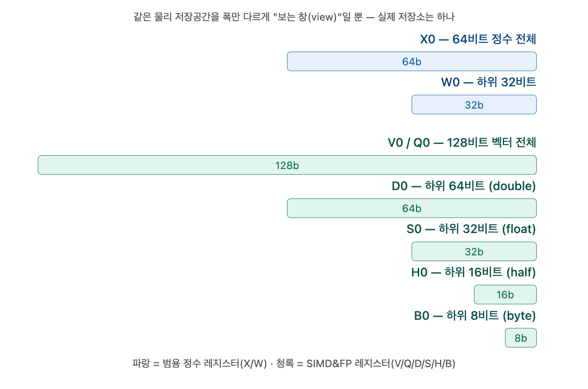

# 레지스터 

갑자기 `v`, `q`, `d`, `s`, `h`, `b`가 쏟아지면 정말 멘붕 먼저 "백신"부터 맞고, 그다음에 실제 NEON 코드를 돌려서 진짜 레지스터 이름이 어떻게 나오는지 보여드릴게요.이제 "백신"을 조금 더 놓고, 바로 실제 코드를 돌려서 진짜 물건을 보여드릴게요.

**중요한 오해 포인트 먼저 짚고 갈게요**: 파란색(X/W)과 청록색(V/Q/D/S/H/B)은 **완전히 별개의 두 개의 레지스터 파일**입니다. `V0`이 `X0`의 "실수 버전"이 아니에요! ARM64는:

- **정수용**: `X0~X30` (+ `XZR`, `SP`) — 총 31~33개
- **SIMD&FP용**: `V0~V31` — 완전히 별도의 128비트 레지스터 32개

이렇게 **물리적으로 완전히 다른 저장 공간**을 갖고 있어요. 같은 그룹 안에서만(`X0`↔`W0`, `V0`↔`Q0`↔`D0`↔`S0`↔`H0`↔`B0`) "같은 저장소를 다른 폭으로 보는 것"이 성립합니다.

## 이제 벡터(4개 float 동시 연산) 실물을 보여드릴게요

`v0.4s` 이런 표기가 나오는데, `.4s`는 "이 128비트 레지스터를 **32비트(Single) 4개짜리 레인(lane)**으로 나눠서 본다"는 뜻이에요. 바로 이게 SIMD(Single Instruction Multiple Data) — "명령어 하나로 4개의 float를 동시에 더한다"는 겁니다.

실제로 컴파일해서 보여드릴게요.Cross-compiler 설치 완료. 이제 실제로 컴파일해서 진짜 어셈블리를 뽑아볼게요.좋아요, 실제로 크로스 컴파일러(`aarch64-linux-gnu-gcc`)로 진짜 ARM64 기계어를 뽑아냈습니다! 시뮬레이션이 아니라 **진짜 실물**이에요.

## 결과 — 4개의 float를 동시에 더하는 벡터 연산

```
0000000000000000 <vec_add4>:
   0:	4e21d400 	fadd	v0.4s, v0.4s, v1.4s   ← 4개 float 동시 덧셈!
   4:	d65f03c0 	ret

0000000000000010 <vec_mul4>:
  10:	4ea19c00 	mul	v0.4s, v0.4s, v1.4s    ← 4개 int32 동시 곱셈!
  14:	d65f03c0 	ret

0000000000000020 <scalar_add>:
  20:	1e212800 	fadd	s0, s0, s1            ← float 딱 1개만 더함 (비교용)
  24:	d65f03c0 	ret
```

## 핵심 비교

| 명령어 | 사용 레지스터 | 의미 | 몇 개를 동시에 처리? |
|---|---|---|---|
| `fadd v0.4s, v0.4s, v1.4s` | **v0, v1** (128비트를 4-lane view로) | float 벡터 덧셈 | **4개 동시에!** |
| `mul v0.4s, v0.4s, v1.4s` | v0, v1 | int32 벡터 곱셈 | **4개 동시에!** |
| `fadd s0, s0, s1` | **s0, s1** (32비트 scalar view) | float 스칼라 덧셈 | 1개만 |

**`.4s`가 핵심이에요.** `v0`이라는 이름은 똑같은데 `.4s`라는 접미사가 붙으면 "이 128비트를 32비트짜리 4조각(lane)으로 쪼개서, 각 조각을 병렬로 계산해라"는 뜻이 됩니다. 그래서 `fadd v0.4s, v0.4s, v1.4s` 한 줄로 사실은:

```
v0[0] = v0[0] + v1[0]
v0[1] = v0[1] + v1[1]
v0[2] = v0[2] + v1[2]
v0[3] = v0[3] + v1[3]
```

이 4개의 덧셈이 **한 클럭에 동시에** 일어나는 거예요 (이게 바로 SIMD — Single Instruction, Multiple Data). 앞서 배운 `mov x1, #0x12`는 명령어 하나가 값 하나를 다루는 "스칼라" 방식이었는데, 이번엔 명령어 하나가 4개의 값을 동시에 다루는 "벡터" 방식인 거죠.

## 기계어 인코딩도 살짝 비교해보면

- `fadd v0.4s...` → `4e21d400` (최상위 니블 `4` = 벡터/SIMD 명령어 계열)
- `fadd s0, s0, s1` → `1e212800` (최상위 니블 `1` = 스칼라 FP 명령어 계열)

**같은 "fadd"(덧셈)인데도 최상위 비트 그룹이 완전히 다릅니다** — 이게 바로 "벡터로 할지 스칼라로 할지"를 CPU가 구분하는 지점이에요. 
