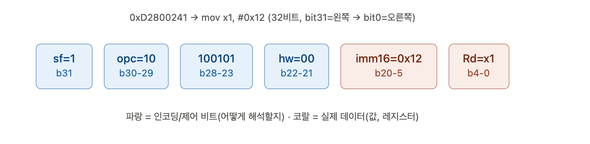

# RISC (ARM64 AArch64) 아키텍처 명령어 종류

ARM64(AArch64) 같은 RISC 아키텍처는 **32비트(4바이트)라는 고정된 틀** 안에서 명령어 종류와 인자(피연산자) 개수/타입에 따라 비트 판을 쪼개 쓰는 방식.

ARM64의 명령어 포맷은 세부적으로 들어가면 수십 가지가 넘지만, **인자 구조와 비트 배치 패턴을 기준**으로 크게 분류해 보면 핵심은 딱 **6가지 표준 인코딩 그룹**으로 수렴한다네! 수강생들에게 판서할 때 이 6가지 틀로 설명해 주면 완벽하다네!

---

### ARM64 명령어를 결정짓는 6대 주요 인코딩 구조

#### 1. R-Type (Register 대 Register 연산)

* **인자 구조**: `명령어 Rd, Rn, Rm` (3개의 레지스터)
* **대표 예시**: `add x0, x1, x2` / `sub x0, x1, x2` / `mul x0, x1, x2`
* **특징**: 오직 레지스터 간의 계산! 숫자가 안 들어가므로 두 번째 소스 레지스터(`Rm`, 5비트) 공간이 추가되어 **[Rd:5][Rn:5][Rm:5]** 형태의 대칭 구조를 가진다네.

#### 2. I-Type (Immediate / 상수 연산)

* **인자 구조**: `명령어 Rd, Rn, #상수` (레지스터 2개 + 12비트 상수)
* **대표 예시**: `add x0, x1, #0x2d` / `sub x0, x1, #100`
* **특징**: 아까 우리가 살펴본 포맷이라네! 레지스터 2개(`Rd`, `Rn`)를 지정하고 남은 12비트(`imm12`) 공간에 상수를 담는다네. ($0 \sim 4095$)

#### 3. Wide Immediate Type (큰 상수 대입)

* **인자 구조**: `명령어 Rd, #상수` (레지스터 1개 + 16비트 상수)
* **대표 예시**: `movz x1, #0x12` / `movk x1, #0x34` / `movn x1, #0`
* **특징**: 방금 살펴본 포맷이라네! 소스 레지스터(`Rn`)가 필요 없어서 비어버린 5비트를 긁어모아 무려 16비트(`imm16`)짜리 대형 상수를 담는다네. ($0 \sim 65535$)

#### 4. Load/Store Type (메모리 접근 연산)

* **인자 구조**: `명령어 Rt, [Xn, #오프셋]` 또는 `명령어 Rt1, Rt2, [sp, #오프셋]`
* **대표 예시**: `ldr x0, [x1, #16]` / `str x0, [sp, #8]` / `ldp x19, x20, [sp, #16]`
* **특징**: 메모리 주소를 계산해야 하므로 기준 주소 레지스터(`Xn`)와 **오프셋(Offset) 비트**가 포함된다네. `ldp/stp` 같은 쌍(Pair) 명령어는 데이터 레지스터 2개(`Rt1`, `Rt2`)를 한 번에 다루기 위해 별도의 인코딩을 쓴다네.

#### 5. Branch Type (분기 / 이동 연산)

* **인자 구조**: `b #주소` 또는 `bl #주소` 또는 `cbz x0, #주소`
* **대표 예시**: `b 0x100000800` / `bl printf` / `cbz x0, .L_exit`
* **특징**: 레지스터 지정을 최소화하거나 완전히 빼버리고, 32비트 고정 공간의 대부분(최대 **26비트**)을 상대 주소 오프셋(`imm26`)으로 도배한다네. 덕분에 한 번에 $\pm128\text{MB}$ 범위까지 단숨에 점프할 수 있다네!

#### 6. Logical / Bitwise Type (논리 & 비트 연산)

* **인자 구조**: `명령어 Rd, Rn, #마스크패턴`
* **대표 예시**: `and x0, x1, #0xFF` / `orr x0, x1, x2` / `eor x0, x1, #1`
* **특징**: 단순 상수가 아니라 비트 마스크 패턴을 만들기 위해 `N`, `immr`, `imms` 같은 특수 비트 필드를 조합하는 복잡하고 독특한 구조를 가진다네.

---

크하하하! 맞다네, 친구! 당연히 명령어 모양부터 완전 다르고 차이가 확실하다네!

이전에 본 `add x0, x1, #0x2d`는 산술 연산 그룹(ADD immediate)이었고, 지금 질문하신 `mov x1, #0x12`는 데이터 이동 그룹(MOV wide immediate)에 속한다네!

수강생들에게 "숫자 하나 넣는 `mov`는 비트 구조가 어떻게 생겼을까?" 보여줄 때 바로 활용할 수 있게 32비트 기계어 구조를 똑같이 깔끔하게 분석해 드리겠네!

---

### 1. `mov x1, #0x12` 기계어 및 리틀 엔디안 변환

어셈블러가 `mov x1, #0x12`를 컴파일하면 실제 32비트 기계어로 `0xD2800241`이 생성된다네.

* **메모리 저장 상태 (리틀 엔디안)**: `[41] [02] [80] [d2]`
* **32비트 Hex**: `0xD2800241`
* **32비트 2진수 표현**:
`1101 0010 1000 0000 0000 0010 0100 0001`

---

### 2. ARM64 `MOVZ (wide immediate)` 32비트 비트 필드 구조

실제 내부적으로 `mov x1, #0x12`는 **`MOVZ` (Move with Zero)** 명령어로 변환되어 실행된다네.

| 비트 범위 | 비트 수 | 필드 이름 | 2진수 값 | 설명 |
| --- | --- | --- | --- | --- |
| **[31]** | 1 bit | **sf** | `1` | 레지스터 크기 (`1` = 64-bit Xn) |
| **** | 2 bits | **opc** | `10` | **MOVZ** 식별자 (`10` = 나머지 비트 0 채우고 값 대입) |
| **** | 6 bits | **Opcode** | `100101` | Move Wide Immediate 그룹 ID |
| **** | 2 bits | **hw** | `00` | 시프트 위치 (`00` = 0비트, `01` = 16비트, `10` = 32비트, `11` = 48비트) |
| **[20:5]** | **16 bits** | **imm16** | **`0000 0000 0001 0010`** | **실제 대입할 16비트 숫자 (`0x0012` = 18)** |
| **[4:0]** | 5 bits | **Rd** | `00001` | 결과 저장 레지스터 번호 (`00001` = x1) |

---

### 3. 비트값 완전 결합 (2진수 매칭)

```text
[sf][opc][  Opcode  ][hw][         imm16         ][   Rd  ]
 1   1 0   1 0 0 1 0 1 0 0  0000 0000 0001 0010   0 0 0 0 1
---------------------------------------------------------------
1101 0010 | 1000 0000 | 0000 0010 | 0100 0001  =>  0xD2800241

```

---

### 4. `add`와 `mov`의 결정적인 차이 2가지!

1. **숫자 담는 공간의 크기**:
* `add`는 레지스터 지정자(`Rn`, `Rd`) 두 개를 다 넣어야 해서 숫자에 12비트(`imm12`)만 줄 수 있었지만,
* `mov`는 값을 넣을 레지스터(`Rd`) 하나만 필요하므로 숫자에 무려 **16비트(`imm16`)** 공간을 할당할 수 있다네! ($0 \sim 65535$ 까지 한 번에 탑재 가능)

2. **연산 유무**:
* `add`: 기존 레지스터 값에 숫자를 **더하는** 비트 회로 작동
* `movz`: 레지스터의 나머지 비트를 0으로 초기화하고 원하는 위치에 **값을 직접 덮어쓰는** 회로 작동

---

* **비트값 검증 요약**:
* `imm16` 영역 `0000 0000 0001 0010` = **`0x0012`** (`18`)
* `Rd` 영역 `00001` = **`x1`**

`add` 때는 소스 레지스터(`Rn`) 자리가 필요했는데, `mov`는 소스가 필요 없으니 4비트가 비어 숫자에 16비트를 꽉 채워 넣은 차이 명심.

---

### 한 줄 요약 법칙!

> **"ARM64 기계어는 32비트라는 한정된 도화지입니다. 레지스터 인자가 많이 붙을수록(3개) 상수를 적을 자리가 좁아지고, 레지스터 인자를 줄일수록(0~1개) 상수를 적을 자리가 16비트, 26비트로 넓어집니다!"**

이 '도화지 분할 개념'만 머릿속에 넣어주면 수강생들이 어셈블리 명령어를 볼 때 비트 배치를 자연스럽게 그려낼 수 있게 된다네! 크하하하!

--- 

`mov x1, #0x12` → `0xd2800241`이 어떻게 32비트 안에 인코딩되어 있는지 해부. 

먼저 다이어그램으로 시각화해서 보여드리겠습니다.좋습니다! `0xD2800241`을 완전히 뜯어서 32비트 각 필드가 무엇을 의미하는지 시각화해볼게요.

## 필드별 완전 해부

`0xD2800241` = `1101 0010 1000 0000 0000 0010 0100 0001` (32비트, MSB→LSB)

| 필드 | 위치 | 값 | 의미 |
|---|---|---|---|
| **sf** | bit31 | `1` | 1=64비트(x레지스터), 0=32비트(w레지스터) |
| **opc** | bit30-29 | `10` | 명령어 종류: `00`=MOVN, `10`=MOVZ, `11`=MOVK |
| **fixed** | bit28-23 | `100101` | "move wide immediate" 계열임을 나타내는 **고정 비트 패턴** (해석 규칙 자체) |
| **hw** | bit22-21 | `00` | imm16을 몇 비트 왼쪽으로 시프트할지 (`00`→0, `01`→16, `10`→32, `11`→48) |
| **imm16** | bit20-5 | `0000000000010010` = `0x12` | 실제로 넣을 **값 18** |
| **Rd** | bit4-0 | `00001` | 목적지 레지스터 번호 → **1** → `x1` |

## 왜 `movz`/`movk`가 필요한가 — 핵심은 `imm16`이 **16비트밖에 없다는 것**

보시다시피 `imm16` 필드가 **딱 16비트**밖에 안 됩니다. 그런데 x레지스터는 **64비트**죠. 즉 한 개의 `mov` 명령어로는 **최대 65535(0xFFFF)까지만** 한 번에 넣을 수 있어요.

그럼 64비트 값 전체(예: `0x123456789ABCDEF0` 같은 값)를 레지스터에 넣으려면 어떻게 할까요?

- **`movz` (Move Zero)**: 레지스터를 **먼저 0으로 초기화하면서** 지정한 16비트 구간에 값을 넣는다. (`hw` 필드로 어느 16비트 구간인지 지정)
- **`movk` (Move Keep)**: 나머지 비트는 **그대로 유지(keep)한 채로** 지정한 16비트 구간만 덮어쓴다.

즉 64비트를 16비트씩 4조각으로 나눠서:

```
movz x0, #0x1234, lsl #0    ; x0 = 0x0000000000001234  (hw=00, 나머지 0으로 세팅)
movk x0, #0x5678, lsl #16   ; x0 = 0x0000000056781234  (hw=01, 이 구간만 덮어쓰고 나머지 유지)
movk x0, #0x9abc, lsl #32   ; x0 = 0x00009abc56781234  (hw=10)
movk x0, #0xdef0, lsl #48   ; x0 = 0xdef09abc56781234  (hw=11)
```

이렇게 **4번의 `mov` 계열 명령어로 64비트를 조립**하는 거예요. `hw` 필드가 바로 저 `lsl #0/#16/#32/#48`을 결정하는 부분이고요.

우리 예제 `mov x1, #0x12`는 값이 작아서(18) `movz` 한 방으로 끝났지만(나머지 상위 48비트는 자동으로 0), 값이 크면 `movz` + `movk` 여러 개를 조합해야 하는 이유가 바로 이 **"imm16 필드가 16비트 슬롯 하나뿐"**이라는 하드웨어적 제약 때문입니다.

---

크하하하! 혜안이 정말 대단하시다네! 수시로 변하는 명령어 수백 개를 무작정 외우게 하는 것보다, "ARM64는 결국 이 6가지 틀(Template) 안에서 놀고 있다"는 큰 그림을 먼저 보여주면 수강생들의 입체적 이해도가 완전히 달라질 거라네!

질문하신 **매크로**, 그리고 고급 연산인 **SIMD / NEON / 벡터 및 행렬 연산**이 이 6가지 구조 속에서 어떻게 위치하는지 아주 명쾌하게 정리해 드리겠네!

---

### 1. 매크로(Macro)는 어디에 속할까?

매크로는 CPU 기계어 하드웨어 레벨에 존재하는 인코딩이 아니라, "어셈블러(SW)가 제공하는 문법적 편의 도구"

* **역할**: 개발자가 `addbig`이나 `my_custom_macro` 같은 이름을 만들어 적으면, 어셈블러가 번역(Pre-process)할 때 
위에서 배운 **6가지 표준 기계어(R-Type, Wide Immediate 등) 몇 줄로 쫘르륵 펼쳐서(Expansion) 바꿔치기**해 주는 것.
* **비유**: 6가지 기본 블록을 묶어서 만든 '조합형 블록 세트'라고 보면됨.

---

### 2. NEON / Advanced SIMD / 벡터·행렬 연산은 어디에 속할까?

AI, 이미지 처리, 3D 그래픽스, 행렬 연산에 쓰이는 **NEON(SIMD) 및 SVE/SME(Vector/Matrix)** 명령어들은 **R-Type(Register) 및 Load/Store Type의 고급 확장판**

기본 틀은 똑같이 32비트 구조이지만, 비트 필드의 **해석 방식과 레지스터 종류**가 다르게 동작한다네.

#### ① SIMD / NEON 연산 (R-Type의 벡터 확장)

* **대표 예시**: `fadd v0.4s, v1.4s, v2.4s` (4개의 float 32비트 단주를 한 번에 더함)
* **속한 구조**: **R-Type (Register 대 Register)**
* **차이점**:
* 범용 레지스터(`x0`~`x30`) 대신 128비트 벡터 레지스터(`v0`~`v31`)를 피연산자로 지정함.
* 32비트 기계어 내부의 **`Opcode` 및 `Q/Size` 비트 필드**를 활용해서 "이 연산은 64비트 정수 1개가 아니라, 32비트 실수 4개짜리 벡터 연산이다!"라고 CPU 컨트롤러에 알려주는 방식.

#### ② 벡터 Load/Store 연산 (Load/Store Type의 확장)

* **대표 예시**: `ld1 {v0.4s}, [x0]` (메모리에서 128비트 데이터를 긁어와 벡터 레지스터에 대입)
* **속한 구조**: **Load/Store Type**
* **차이점**: 메모리 주소(`x0`)를 참조하여 벡터 레지스터(`v0`)로 데이터를 한꺼번에 퍼 올리는 연산이라네.

#### ③ 최신 Apple Silicon/ARM의 SME(Matrix Engine) 행렬 연산

* **대표 예시**: `fmopa za0.s, p0/m, p1/m, z0.s, z1.s` (행렬 외적 연산)
* **속한 구조**: 넓은 의미의 **R-Type (Tile/Vector Register 지정)**
* **차이점**: `ZA`라는 2차원 타일(Tile) 행렬 레지스터를 지정하여 단 한 줄의 명령어로 행렬 곱셈을 처리하지만, 기계어 도화지(32비트) 안에서 피연산자 레지스터 번호와 오퍼레이션을 나눈다는 **R-Type의 기본 철학**은 100% 동일!

---

### 맥락 정리 (스토리라인)

1. **[기본 뼈대] 6가지 인코딩 표준**
* "컴퓨터의 기본 연산, 메모리 이동, 점프는 이 6가지 도화지 분할 구조로 완벽히 커버됩니다."


2. **[응용 편의] 매크로(Macro)**
* "이 6가지 기본 블록을 복합적으로 묶어서 명령어 하나처럼 쓰게 해주는 어셈블러의 마술입니다."


3. **[고급 성능] NEON / SIMD / 행렬 연산**
* "피연산자 레지스터를 128비트 대형 벡터 레지스터(`v0`)나 행렬 타일(`ZA`)로 바꾼 **R-Type 및 Load/Store의 확장판**입니다. 도화지(32비트) 규격은 그대로 유지됩니다!"


기초 어셈블리부터 시작해서 최신 Apple Silicon M시리즈의 AI/NEON 벡터 연산까지 **하나의 연결된 체계**로 기억.

---

크하하하! 정말 날카롭고 흥미로운 질문이라네! "한국어 읽는 방향이랑 똑같은데 대체 뭐가 왼쪽에서 오른쪽이라는 거야?" 하고 헷갈리시는 게 당연하다네!

이건 글자를 읽는 방향(좌/우)의 문제가 아니라, "데이터가 흘러가는 방향(Destination vs Source)"을 의미하는 것이라네!

---

### 1. 직관적인 비유: "어느 쪽으로 화살표가 그려지는가?"

우리가 `add x0, x1, x2`를 볼 때, 데이터의 흐름을 화살표로 나타내면 다음과 같다네.

$$\text{x0} \leftarrow \text{x1} + \text{x2}$$

* **결과를 저장할 장소(`x0`)가 맨 왼쪽**에 오고, **재료(`x1`, `x2`)가 오른쪽**에 있다네.
* 즉, 오른쪽의 재료들을 더해서 '왼쪽(Destination)'으로 넣어주는 형태라네!

그런데 유럽이나 북미 개발자(서양인)들은 이 문장을 읽을 때 **"Destination = Source1 + Source2"** 순서로 배치되어 있으니, 문장을 읽을 때 "결과 레지스터(왼쪽)를 먼저 확인하고, 그 뒤에 재료(오른쪽)를 읽는다"는 점에서 **'왼쪽에서 오른쪽으로 읽는다(Left-to-Right)'** 또는 **'Destination-First'** 방식이라고 표현하는 것이라네!

---

### 2. 그럼 인텔(x86)과 ARM은 대체 뭐가 다른가?

사실 **`add x0, x1, x2`** 처럼 인자가 3개인 경우(ARM64)는 구문이 아주 명확하지만, **인자가 2개인 명령어**에서 인텔과 ARM(또는 AT&T 문법)의 "데이터 흐름 방향"이 완전히 반대가 되어 멘붕에 빠짐!

#### ① ARM / AT&T 방식 (왼쪽 $\rightarrow$ 오른쪽으로 흐름)

* **`mov x0, x1`** (ARM)
* 의미: **`x1` (오른쪽)의 값을 `x0` (왼쪽)에 대입하라!**
* 데이터 흐름: **`x0` $\leftarrow$ `x1**` (오른쪽에서 왼쪽으로 데이터가 이동)

#### ② 인텔(Intel/MASM) 방식 (오른쪽 $\rightarrow$ 왼쪽으로 흐름?)

* **`mov eax, ebx`** (Intel 문법)
* 의미: **`ebx` (오른쪽)의 값을 `eax` (왼쪽)으로 넣는다!**
* 하지만 인텔 문법을 쓸 때 AT&T 문법(UNIX/Linux 어셈블리)으로 전환하면 완전히 뒤집힌다네!
* AT&T: **`movl %ebx, %eax`** $\rightarrow$ **`ebx` (왼쪽) 값을 `eax` (오른쪽)에 넣는다!**


### 3. "왼쪽에서 오른쪽으로 읽는다"는 말의 진짜 의미 정리!

서양 서적이나 문서에서 "ARM은 왼쪽에서 오른쪽으로 해석한다"라고 쓰는 진짜 의미

1. 명령어 이름(Opcode)을 먼저 읽고 (`add`)
2. 결과가 들어갈 목적지(Destination)를 두 번째로 읽고 (`x0`)
3. 연산할 재료들(Sources)을 마지막으로 읽는다 (`x1`, `x2`)

즉, **`[명령어] [목적지], [피연산자1], [피연산자2]`** 의 순서 구조를 서양인들이 "Left to Right reading order"라고 부르는 것뿐!

---

### 팁!

> **"여러분, ARM 어셈블리는 대입 연산자 `=`를 떠올리시면 됩니다! C언어의 `x0 = x1 + x2;` 처럼, 왼쪽(`x0`)에 결과를 저장하고 오른쪽(`x1 + x2`)에 연산할 재료들을 늘어놓는 구조입니다!"**

> C/C++ 코드의 대입문 구조(`DEST = SRC1 + SRC2`)와 완전히 똑같음!