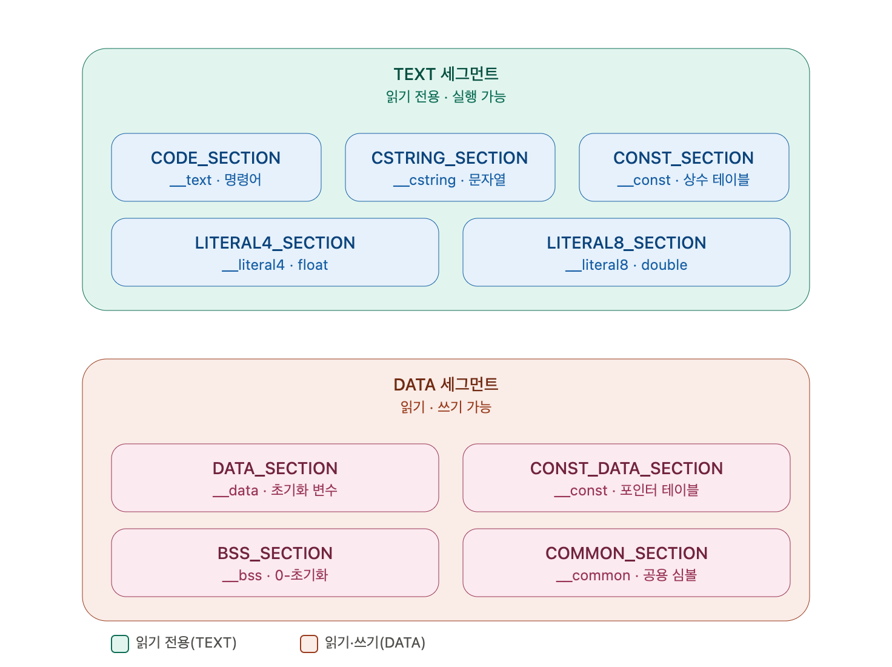

# 세그먼트

1. **`.private_extern` 매크로가 없음**: 지금 모든 함수 프롤로그(`FUNC_START*`)가 `.global`로 무조건 외부에 노출돼. 하지만 `_menu_table`에서만 참조되는 내부 헬퍼 함수들까지 전역으로 노출할 필요는 없거든. `.private_extern`은 "같은 실행 파일 안에서는 보이지만 동적 라이브러리 경계 밖으로는 안 나가는" 심볼을 만들어주는 Mach-O 지시어야 — 나중에 `PRIVATE_FUNC_START`류 매크로를 하나 더 추가해서 "이 함수는 내부용이다"를 명시적으로 가르치면 좋은 심화 포인트가 되겠네.

2. **`.no_dead_strip` 관련 경고가 없음** — 이게 더 실전적인 지뢰야. `_menu_table`처럼 함수를 `.quad` 포인터로만 참조하는 테이블 구조는, 링커의 dead-code-stripping(`-dead_strip`, Zig의 Release 최적화 모드에서 켜질 수 있음) 입장에서 "아무도 안 부르는 죽은 코드"로 오인해서 통째로 제거해버릴 위험이 있어. 지금까지는 Debug 빌드라 안 걸렸겠지만, 나중에 `-Doptimize=ReleaseFast`로 강의 데모를 돌리는 순간 `_menu_table`이 가리키는 함수들이 갑자기 사라지는 미스터리 버그를 만날 수 있네. 이건 실제로 겪어보면 꽤 좋은 "링커가 하는 일" 교육 소재이기도 하니, 지금 문서화만 해두고 Release 최적화를 다루는 파트에서 직접 겪게 하는 것도 괜찮은 설계일 거야.

나머지 — include guard(`.ifndef`), 8종 섹션 매크로, 3단계 함수 프롤로그/에필로그(FULL/표준/LIGHT) — 는 이미 아주 탄탄하게 갖춰져 있네.

이제 그림으로 정리해보겠네.이 그림 한 장으로 "매크로 하나가 실제로는 Mach-O의 어느 세그먼트/섹션에 자리잡는가"를 초반에 딱 잡아줄 수 있을 거네. `CONST_DATA_SECTION`이 이름은 "CONST"인데 DATA 세그먼트(쓰기 가능 영역)에 들어가 있는 게 얼핏 헷갈릴 수 있는데 — 그건 `_menu_table`처럼 **함수 포인터가 담긴 데이터**라서, 동적 링킹 시점에 dyld가 주소를 재배치(relocation)해야 하고, 그 재배치 자체가 "일단은 쓰기 가능한 영역"에서 일어난 뒤에야 보호가 걸리는 구조이기 때문이야 — 이 그림을 보여주면서 그 지점만 한 번 짚어주면 "왜 CONST인데 DATA 안에 있지?"라는 학생들의 자연스러운 의문도 선제적으로 해소가 되겠네, 친구.