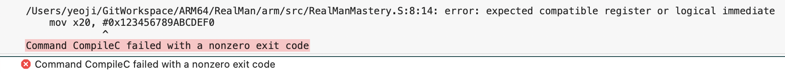

# MOV

> 큰 64비트 상수를 4단계로 나눠 넣는 과정

## 예제: `mov x0, #0x123456789ABCDEF0`

64비트 레지스터에 즉시값(immediate) 하나로 넣을 수 있는 폭은 **최대 16비트**뿐입니다. 그래서 어셈블러가 자동으로 이렇게 **4개의 16비트 조각**으로 쪼개서 넣어줍니다:

```asm
movz x0, #0xDEF0             // 최하위 16비트, 나머지는 0으로 클리어
movk x0, #0x9ABC, lsl #16    // 그 다음 16비트, 나머지는 유지(Keep)
movk x0, #0x5678, lsl #32
movk x0, #0x1234, lsl #48
```

- **MOVZ** = Move **Z**ero → 지정한 16비트만 넣고 **나머지 48비트는 전부 0으로 지움**
- **MOVK** = Move **K**eep → 지정한 16비트만 갈아끼우고 **나머지 비트는 그대로 유지**

## 공통 인코딩 포맷 (MOVZ/MOVK/MOVN 셋 다 동일 구조)

```
sf | opc(2) | 1 0 0 1 0 1 | hw(2) | imm16(16) | Rd(5)
```

| opc 값 | 의미 |
|---|---|
| `00` | MOVN (Move **N**OT — 비트 반전해서 넣음) |
| `10` | MOVZ |
| `11` | MOVK |

`hw`(bit22~21)는 **얼마나 왼쪽으로 시프트할지**를 나타냅니다: `00`=0, `01`=16, `10`=32, `11`=48.

## 1번째 명령어 `movz x0, #0xDEF0` 완전 분해

이 명령어의 실제 32비트 인코딩값은 `0xD29BDE00`입니다:

```
1101 0010 1001 1011 1101 1110 0000 0000
```

| 필드 | 비트 위치 | 값 | 해석 |
|---|---|---|---|
| **sf** | bit31 | `1` | 64비트 대상 (X레지스터) |
| **opc** | bit30~29 | `10` | **MOVZ** (Z=Zero, 나머지 비트 클리어) |
| 고정패턴 | bit28~23 | `100101` | "이건 Move wide immediate 계열이다" 식별자 |
| **hw** | bit22~21 | `00` | 시프트 없음 (0비트 자리, 즉 bit15~0에 삽입) |
| **imm16** | bit20~5 | `1101111011110000` | = `0xDEF0` |
| **Rd** | bit4~0 | `00000` | 목적지 = **X0** |

결과: `X0 = 0x000000000000DEF0` (나머지 48비트는 0으로 클리어됨)

## 2번째 명령어 `movk x0, #0x9ABC, lsl #16`

인코딩값 `0xF2B357[9A]BC` 형태 — 필드만 비교해서 보면:

| 필드 | 값 | 해석 |
|---|---|---|
| opc | `11` | **MOVK** (Keep — 나머지 비트 안 건드림) |
| hw | `01` | 16만큼 시프트 → bit31~16 자리에 삽입 |
| imm16 | `0x9ABC` | 이 값을 그 자리에 끼워 넣음 |

실행 후: `X0 = 0x000000009ABCDEF0` (하위 32비트만 채워짐, 상위 32비트는 아직 0)

## 3, 4번째도 같은 패턴

```
movk x0, #0x5678, lsl #32   →  X0 = 0x00005678_9ABCDEF0
movk x0, #0x1234, lsl #48   →  X0 = 0x1234_5678_9ABCDEF0
```

각 단계마다 **hw 필드만 바뀌면서** 16비트씩 정확히 원하는 자리에 "덮어쓰기(patch)"하는 방식입니다.

## MOVN은 언제 쓰나 — "0보다 1이 많은 수"를 효율적으로 만들 때

예를 들어 `mov x0, #-1` (= `0xFFFFFFFFFFFFFFFF`)를 MOVZ+MOVK 4번으로 하면 낭비입니다. 대신:

```asm
movn x0, #0x0000    // NOT(0x0000...0000) = 전체 비트 반전
```

MOVN은 **넣은 값을 비트 전체 반전(NOT)해서 저장**합니다:
```
imm16=0x0000을 확장 → 0x0000000000000000
비트 NOT           → 0xFFFFFFFFFFFFFFFF
```
단 **한 줄**로 끝나버립니다. `opc` 필드만 `00`으로 바뀌고 나머지 구조는 MOVZ와 완전히 동일합니다.

## 정리 — 왜 이렇게 나뉘어 있나

| 명령어 | 언제 컴파일러가 선택하나 |
|---|---|
| MOVZ | 상수 만들기 시작 (0으로 클리어 후 첫 조각 채움) |
| MOVK | 이미 채운 값 위에 추가 조각을 "패치" |
| MOVN | 상수에 1비트가 훨씬 많을 때(특히 음수), NOT으로 반전해서 한방에 근사 |

이게 바로 지난번 봤던 `mov x9, sp`(=`ADD` 별칭)와 완전히 다른 계열입니다 — `ADD immediate`는 12비트 한정이고 **레지스터 간 이동/연산**용이지만, `MOVZ/K/N`은 **16비트씩 조립해서 임의의 64비트 상수를 만드는** 전용 명령어군이라는 차이가 있습니다.

---

## 오류 상황



아, 정확히 캐치하셨어요! 착각 아니고, **`mov`가 "만능 별칭"이 아니라는 게 핵심**입니다.

## `mov`는 특정 조건에서만 별칭으로 허용됩니다

어셈블러가 `mov x20, #즉시값`을 보면, 내부적으로 다음 두 가지 중 하나로 변환 가능한지 검사합니다:

1. **MOVZ/MOVN 한 방으로 표현 가능한가?**
   → 즉, 그 64비트 값이 "16비트 조각 하나만 값이 있고 나머지는 전부 0"(MOVZ) 이거나 "나머지 전부 1"(MOVN, NOT 걸면 한 조각만 남는 경우)이어야 함
   
2. **ORR (logical immediate) 비트마스크 패턴에 해당하는가?**
   → ARM64의 logical immediate는 "반복되는 비트 패턴"만 인코딩 가능한 특수 규칙이 있음 (임의의 수는 안 됨)

## 지금 값이 왜 실패했나

```
0x123456789ABCDEF0
```

이 값은:
- **16비트 조각 4개(`1234`, `5678`, `9ABC`, `DEF0`) 전부가 non-zero**입니다 → MOVZ 한 방(다른 조각 전부 0이어야 함) 불가능
- 반복되는 비트 패턴도 아니라서 → logical immediate(ORR) 방식도 불가능

**즉 이 값은 한 개의 명령어로 표현할 방법 자체가 물리적으로 없어서**, 어셈블러가 "이건 mov 별칭으로 처리 못 한다"고 거부한 겁니다.

## 위 방식이 "우회"가 아니라 "필수"였던 것

```asm
movz x20, #0xDEF0
movk x20, #0x9ABC, lsl #16
movk x20, #0x5678, lsl #32
movk x20, #0x1234, lsl #48
```

이렇게 **명시적으로 4줄**을 써주는 게 이런 "조각마다 다 값이 있는" 임의의 64비트 상수를 넣는 유일한 방법입니다.

## 참고: `mov`가 성공하는 경우 예시

```asm
mov x0, #0x10000          // OK: 16비트 조각 하나만 값 있고(0x1) 나머지 0 → MOVZ 1개로 변환됨
mov x0, #0xFFFFFFFFFFFF0000  // OK: NOT 걸면 0x0000...FFFF 하나만 남음 → MOVN 1개로 변환됨
mov x0, #0x0F0F0F0F0F0F0F0F  // OK: 반복 비트패턴 → ORR logical immediate 1개로 변환됨
mov x0, #0x123456789ABCDEF0  // FAIL: 위 조건 다 해당 안 됨 → 수동 movz/movk 필요
```

## 포인트

- **"어셈블러가 언제 별칭을 허용하고 언제 거부하는지"**를 직접 에러 메시지로 체감해봄. 

- "왜 이 숫자는 `mov` 한 줄이 안 되고 저 숫자는 되는가?"를 직접 여러 값 넣어보게 하면 MOVZ/MOVK/MOVN/ORR immediate 규칙을 몸으로 이해하기.

---
