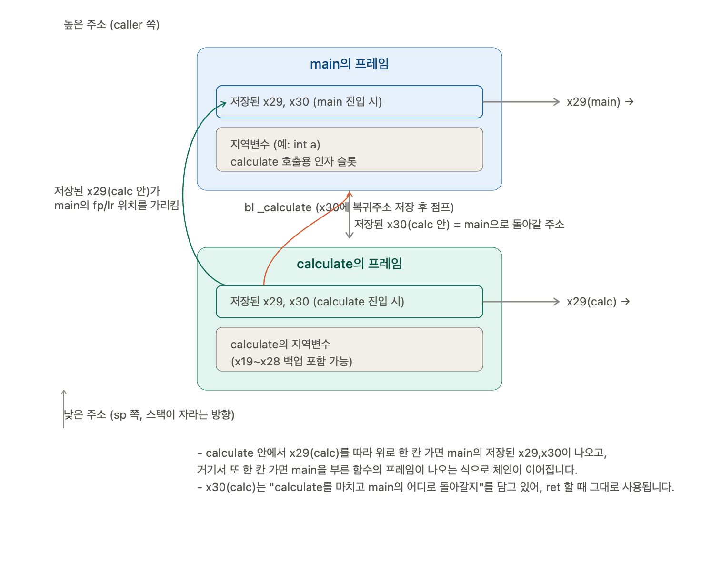

# PART 1

---

### 1. `clang` 컴파일 명령어에 `-g` 추가

기존 명령어에 **`-g` (디버그 심볼 포함)** 및 디버깅 편의를 위한 옵션을 추가하셔야 합니다.

```bash
clang -g -O0 -arch arm64 main.c -S -o generated.s

```

* **`-g`**: C 소스 코드의 행 번호와 변수 이름을 디버그 심볼(DWARF)로 어셈블리에 남깁니다.
* **`-O0`**: 컴파일러 최적화를 끕니다. (최적화가 들어가면 레지스터가 꼬이거나 코드가 생략되어 수강생이 C 코드와 1:1 비교를 못 하게 됩니다).

> **💡 핵심 팁 (C 코드 위치 표시)**
> `-g`를 붙이고 `-S`로 생성된 `.s` 파일을 열어보면, 어셈블리 중간중간에 `.loc 1 12 3` 같은 DWARF 지시어가 삽입되어 **"이 어셈블리가 C 언어의 몇 번째 줄에서 생성되었는지"** LLDB가 인지할 수 있게 됩니다.

---

### 2. 저급(Low-level) 방식을 보여주기 위한 전통적 빌드 과정

학생들에게 컴파일러의 내부 동작(어셈블 -> 링킹)을 직관적으로 시연할 때 사용할 수 있는 고전 명령어 패키지입니다.

**순수 어셈블리 빌드 (Apple Silicon / macOS 기준):**

```bash
# 1. 어셈블 (Source -> Object File) + 디버그 심볼(-g)
as -g -arch arm64 main.s -o main.o

# 2. 링킹 (Object File -> Executable)
# macOS SDK 경로를 지정해 주어야 System Framework 및 dyld 라이브러리가 연결됩니다.
ld -lSystem -syslibroot $(xcrun --show-sdk-path) -e _main -arch arm64 main.o -o asm_out

```

---

### 3. LLDB에서 C 코드와 어셈블리를 동시에 보며 디버깅하기

`-g` 옵션으로 빌드된 결과물을 실행할 때 수강생들에게 보여주면 아주 좋은 LLDB 명령어 3가지입니다.

* **`gui` (TUI 디버깅 모드)**
* LLDB 실행 후 `gui`를 입력하면 C 소스 코드, 레지스터, 변수 목록이 한 화면에 비주얼하게 뜨는 TUI 환경으로 전환됩니다.


* **소스 코드와 어셈블리 동시 출력**
```text
(lldb) disassemble --mixed --frame

```


* C 언어 코드 한 줄과 그 밑에 해당하는 ARM64 어셈블리를 번갈아가며 나란히 출력해 주므로 강좌 시각 자료로 최적입니다.


* **레지스터 실시간 관찰**
```text
(lldb) register read --all

```


---

### 4. 제공해 주신 `build.zig` 관전평 & 팁

첨부해 주신 Zig 스크립트에서 **디버그 기호 보존** 및 **Mac 전용 런타임 처리**를 미리 깔끔하게 처리해 두신 부분이 인상적입니다.

```zig
exe.root_module.strip = false; //[cite: 1]
if (os_tag == .macos) {
    exe.bundle_compiler_rt = true; //[cite: 1]
}

```

나중에 C 언어를 떼어내고 Rust / Go / .NET AOT dylib에서 C ABI (`extern "C"`)로 어셈블리 함수를 바로 호출하는 단계로 넘어가실 때도, 위와 같이 Zig가 전체를 패키징하고 있으니 디버그 심볼(`dsymutil` 생성 등)만 챙겨주시면 LLDB에서 고급 언어 Runtime 영역과 pure ARM64 어셈블리 영역을 자유자재로 넘나들며 추적할 수 있는 환상적인 플레이그라운드가 될 것 같습니다.


