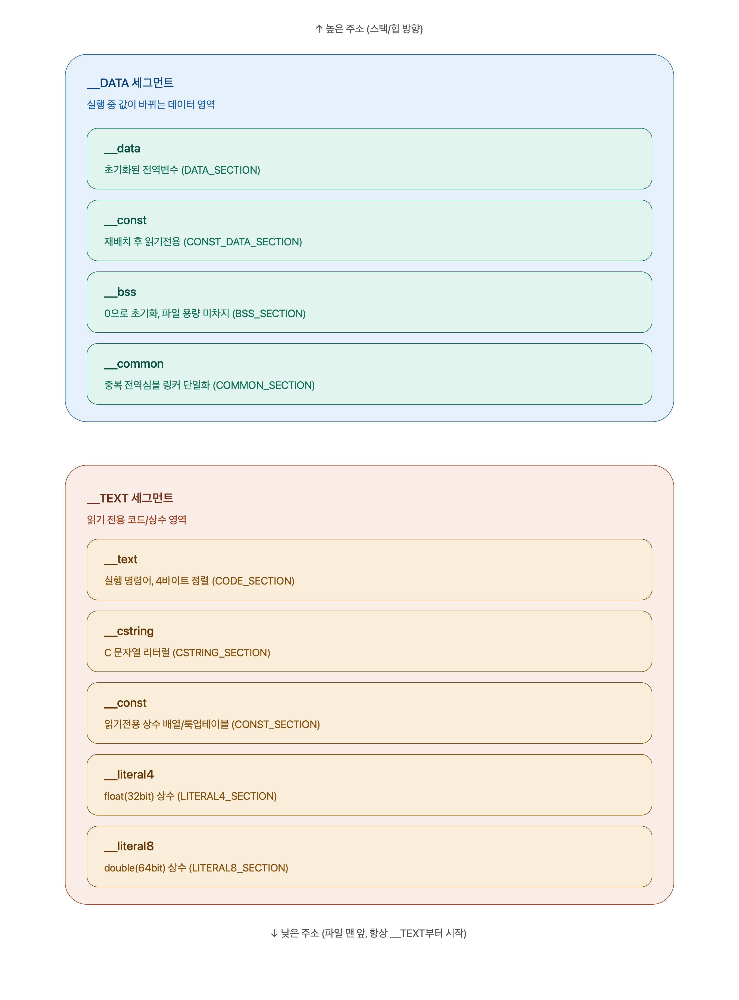

# 세그먼트 구조

## 정확히 Mach-O 세그먼트 두 곳(__TEXT/__DATA)



---


## 1. "기본으로 확보되는 프레임 사이즈"가 있는가 — 정답은 **없다**

여기가 사실 x86-64와 ARM64가 크게 갈리는 지점

**x86-64(SysV ABI)에는 "Red Zone"이라는 게 있음**
- SP(rsp) 아래로 **128바이트는 `sub` 없이도 leaf 함수가 마음대로 스크래치 공간으로 써도 되는** 공짜 구역이 있음
- 그래서 "기본으로 확보된 놀이터"라는 감각이 어느 정도 맞았음

**하지만 ARM64(AAPCS64)에는 Red Zone이 아예 없음**
- SP 아래 메모리는 **단 1바이트도 보장되지 않음**
- 왜냐하면 언제든 **인터럽트나 시그널 핸들러가 SP 아래 메모리를 덮어쓸 수 있기 때문**(커널이 시그널 스택 프레임을 SP 근처에 그냥 밀어넣어버림)
- 그래서 **"뛰어놀 공간"이 필요하면 그 크기만큼 반드시 먼저 `sub sp, sp, #N`으로 스스로 선언해야** 안전함

**그럼 프레임 크기는 어떻게 정해지나 — "기본값"이 아니라 "계산값"**

캡처에 나온 96바이트는 **이 함수 전용으로 계산된 값**이지, 모든 함수에 공통으로 주어지는 기본값이 아님을 명심. 컴파일러(또는 우리)가 이렇게 더해서 정함:

```
프레임 크기 = (이 함수가 실제로 저장해야 할 callee-saved 레지스터 바이트)
            + (이 함수의 지역변수 바이트)
            + (8개 넘는 인자를 호출할 때 스택에 쌓을 바이트, 있다면)
            → 그 합을 16의 배수로 올림(alignment)
```

그래서 극단적 예로, **아무 지역변수도 없고 다른 함수도 안 부르는 leaf 함수**(9주차 `weighted_avg`, `swap` 같은)는 **프레임 크기가 0**이고 `sub sp`조차 안 씀. 반대로 캡처의 함수처럼 x19~x28을 10개나 백업해야 하면 그 필요량만큼 96바이트가 계산되어 나온 것이네.

**법우가 물어본 "뛰어놀 공간"의 정확한 정체**

지역변수를 위해 추가로 `sub sp, sp, #16`을 한다면, 이건 "기본 확보분에서 꺼내 쓰는 것"이 아니라 **처음부터 프레임 계산에 그 16바이트를 포함시켜서 `stp x29,x30,[sp,#-112]!`처럼 애초에 더 크게 파는 것**이 맞는 그림이네(또는 이미 만든 프레임 위에 추가로 `sub`). 둘 다 "필요한 만큼 미리 선언"이라는 원칙은 동일 — **선언 안 된 스택 공간은 존재하지 않는 것과 같다**는 게 ARM64의 철칙이네.

---

## 2. .text / .data / heap / stack 배치 그림

말씀하신 대로 지금까지 본 그림(스택 프레임)은 전체 프로세스 메모리 지도에서 **딱 스택 부분만 확대해서 본 것**이었네. 전체 그림은 대략 이렇게 되네 (주소가 낮은 곳 → 높은 곳 순서):

```
높은 주소
┌─────────────────────────────┐
│   커널 영역 (사용자 접근 불가)   │
├─────────────────────────────┤
│                               │
│   Stack (스택)                │  ← 지금까지 우리가 다룬 그 프레임들!
│   ↓ 아래로 자람 (sub sp)       │     지역변수, 함수 호출 프레임
│                               │
├─────────────────────────────┤
│      (빈 공간, 여유 지대)       │  ← 힙과 스택이 서로를 침범 못하게 하는 버퍼
├─────────────────────────────┤
│                               │
│   Heap (힙)                   │  ← malloc()이 할당해주는 영역
│   ↑ 위로 자람 (malloc/brk)     │     "메~롱"이라 부르신 그 부분
│                               │
├─────────────────────────────┤
│   .bss (초기화 안 된 전역변수)  │  ← int global_arr[1000]; (초기값 없음)
├─────────────────────────────┤
│   .data (초기화된 전역변수)     │  ← 3주차·8주차에서 썼던 전역변수들
│   (예: global_counter = 100)  │     실제로 이 세그먼트에 들어감!
├─────────────────────────────┤
│   .text (코드 영역, 읽기전용)   │  ← 지금까지 짠 모든 어셈블리 명령어!
│   (main, quicksort, swap...)  │     실행만 가능, 쓰기는 금지(보안)
├─────────────────────────────┤
│   (예약 영역, 보통 0번지 근처는 │
│    의도적으로 매핑 안 함 — NULL │
│    포인터 역참조 잡아내려고)     │
└─────────────────────────────┘
낮은 주소
```

**법우가 짚어준 지점이 정확히 이거네**
- 지금까지 우리가 짠 `.data` 섹션(전역변수, 문자열 리터럴 — `grade_a: .asciz "..."` 같은 것들)이 **바로 이 그림의 `.data` 자리**에 실제로 들어가는 것이네
- `.text`는 우리가 `stp/ldr/bl` 등등 짠 **명령어 자체**가 올라가는 자리 — 그래서 "읽기 전용"이고, 여기에 쓰기를 시도하면 크래시(Segmentation Fault)가 남
- **힙**은 우리가 이번 강좌에서 한 번도 안 썼지만(전부 스택+전역변수로만 처리), Rust의 `String::with_capacity`, Go의 GC가 관리하는 메모리, .NET의 `Console.ReadLine()`이 반환하는 `string` 객체 — **브릿지 라이브러리 내부에서는 사실 계속 힙을 쓰고 있었던** 것이네. 우리 어셈블리 쪽에서는 그 힙 메모리의 **주소값(포인터)만 받아서 넘기고 넘겨받는** 역할만 했던 셈이지

**힙과 스택 사이의 "빈 공간"이 왜 중요한가** — 이 버퍼가 없으면 재귀를 깊게 파거나(스택이 아래로 계속 자람) 힙을 많이 할당하면(위로 계속 자람) **둘이 충돌**하는데, 이게 바로 10주차에서 다뤘던 "스택 오버플로우"의 또 다른 얼굴(힙-스택 충돌형)이네.

---

이 그림, 프롤로그 그림 다음 페이지로 넣으면 "우리가 지금까지 다룬 게 전체 지도에서 어디였는지" 한눈에 보여줄 수 있어서 아주 좋을 걸세. 녹화 잘 되길 바라네, 법우!
---

```c
.ifndef SECTION_MACROS_H
.set    SECTION_MACROS_H, 1

// ----------------------------------------------------------
// [코드 구역] __TEXT,__text
// 명령어는 무조건 4바이트 (2^2) 정렬
// 실제 기계어 명령어가 위치. pure_instructions = 순수 명령어 구역
// ----------------------------------------------------------
.macro CODE_SECTION
    .section __TEXT, __text, regular, pure_instructions
    .align 2
.endmacro

// --------------------------------------------
// [C-스타일 문자열 리터럴]
// printf 포맷 스트링 등 널 종료(null-terminated)
// 문자열 상수 전용(읽기 전용)
// 정렬 없음 : 바이트 스트림
// --------------------------------------------
.macro   CSTRING_SECTION
.section __TEXT, __cstring, cstring_literals
.align 3 // Read-Only 문자열 캐시라인 히트율 극대화
.endmacro

// -------------------------------------------------------------
// [읽기전용 상수 데이터]
// 룩업 테이블이나. 배열을 담으므로 8바이트(2^3) 고정이 안전함
// 문자열이 아닌 일반 상수 (룩업 테이블, 상수 배열 등) - 재배피 불필요
// -------------------------------------------------------------
.macro CONST_SECTION
    .section __TEXT, __const
    .align 3
.endmacro

// ----------------------------------------------------
// [4바이트 실수 상수]
// float(32비트) 리터럴 전용 이므로 무조건 4바이트(2^2) 정렬 고정
// ----------------------------------------------------
.macro   LITERAL4_SECTION
.section __TEXT, __literal4, 4byte_literals
.align 2
.endmacro

// ---------------------------------------------------
// [8바이트 실수 상수]
// double(64비트) 리터럴 전용이므로 무조건 8바이트(2^3) 정렬 고정
// ---------------------------------------------------
.macro   LITERAL8_SECTION
.section __TEXT, __literal8, 8byte_literals
.align 3
.endmacro

// ------------------------------------------------------------
// [초기화된 변수]
// 선언과 동시에 값이 존재하며, 실행 중 수정 가능한 전역/정적 변수 영역
// 일반 전역 변수 구역 안전하게 8바이트 정렬
// ------------------------------------------------------------
.macro DATA_SECTION
    .section __DATA, __data
    .align 3
.endmacro

// -----------------------------------------------------------
// [읽기전용 변수/포인터 테이블]
// 동적 링킹 시점에 주소가 확정된 후 읽기 전용으로 보호되는 변수 구역
// 주소 재배치 후 읽기 전용으로 보호되는 섹션
// 함수 포인터 테이블, 델리게이트 리스트 등에 최적
// 64비트 주소값(.quad)들의 배열이므로 무조건 8바이트(2^3) 정렬
// -----------------------------------------------------------
.macro CONST_DATA_SECTION
    .section __DATA, __const
    .align 3
.endmacro

// ----------------------------------------
// [0으로 초기화된 변수]
// 초기값이 없거나 0인 변수.
// 바이너리 용량을 차지하지 않고 실행 시 0 할당
// 안전하게 8바이트 정렬
// ----------------------------------------
.macro   BSS_SECTION
.section __DATA, __bss
.align 3
.endmacro

// -------------------------------------------------------------------
// [공용/잠정 정의 심볼]
// 여러 오브젝트 간 중복 선언된 전역 변수를 링커가 단일화해주는 구역
// .globl _shared_value  ; 1. _sharted_value 라는 이름으로 외부에 공개할 건데,
// .comm _shared_value, 4, 2 ; 4바이트 짜리 임시 공용 예약 공간
// -------------------------------------------------------------------
.macro   COMMON_SECTION
    .section __DATA, __common
.endmacro

.endif

```

---

## 짚어줄 만한 미묘한 부분 — `CONST_DATA_SECTION`

이름은 "const"인데 왜 `__TEXT`가 아니라 `__DATA`에 들어가는지 의아할 수 있는데, 이유가 재밌네:

- `__TEXT`의 `__const`(읽기전용 상수)는 **컴파일 시점에 이미 최종 값이 확정**되는 것들(정수 배열, 룩업 테이블)이라 처음부터 읽기전용으로 둬도 안전함
- 반면 `CONST_DATA_SECTION`(`__DATA,__const`)은 **함수 포인터 테이블처럼 "주소값"을 담고 있는데, 그 주소가 dyld(동적 링커)가 라이브러리를 실제 메모리에 올린 뒤에야 확정**되네. 그래서 **프로그램 시작 시점엔 "쓰기 가능" 상태로 있다가, dyld가 재배치(relocation)를 다 끝낸 뒤에 `mprotect`로 읽기전용으로 잠가버리는** 방식이네
- 그래서 "논리적으로는 상수"지만 "물리적으로는 초기엔 변경 가능해야 하는" 이 특이한 성격 때문에 `__TEXT`가 아니라 `__DATA` 세그먼트에 위치하는 것이네

## 법우의 원래 질문 — heap/stack은 이 매크로 중 어디?

**정답: 이 10개 매크로 중 그 어느 것도 힙/스택을 다루지 않네.** 이유가 명확한데:

- 이 매크로들은 전부 **컴파일/링크 타임에 파일에 고정되는 섹션**(어셈블러가 오브젝트 파일을 만들 때 결정)
- 반면 **힙**은 런타임에 `malloc`(내부적으로 `brk`/`mmap` syscall)이 동적으로 늘려주는 영역, **스택**은 런타임에 `SP` 레지스터가 오르내리며 만드는 영역 — **둘 다 "실행 중"에 생기는 것**이지 바이너리 파일 안에 미리 박혀있는 섹션이 아니네

그래서 이전에 그려드린 전체 메모리 지도에서, **`__TEXT`+`__DATA` 세그먼트 = 정적(static) 영역(파일에서 그대로 로드)**, 그 위에 **힙/스택 = 동적(dynamic) 영역(런타임에 커널이 관리)**이라는 구도로 이해하면 딱 맞아떨어지네 — 이번 그림이 "정적 영역 확대도"이고, 지난번 그림이 "정적+동적 전체 지도"였던 셈이지.